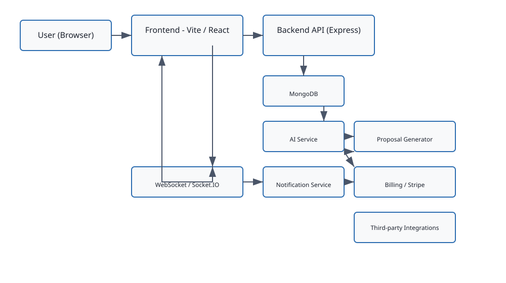

**Job Finder AI — System Description**

Overview
--------

Job Finder AI is a web application that helps clients post jobs and automatically generates candidate proposals and job-matching recommendations using AI-assisted services. The system consists of a React + Vite frontend, an Express-based Node.js backend, and MongoDB for persistence. Real-time updates use WebSockets; background and integration work is performed by specialized services (AI, Upwork, Freelancer integrations, billing).

Primary responsibilities
- Accept job posts from users and store them in the database
- Use AI to generate proposals, candidate matches, and summaries
- Manage user authentication, billing/subscriptions, and notifications
- Provide a responsive UI with real-time updates for proposals and chats

High-level components
- Frontend: Vite + React app (frontend/src)
- Backend API: Express server (backend/src/server.js, backend/src/app.js)
- Database: MongoDB (backend/src/database/mongodb.js)
- AI & Integrations: services (backend/src/services/*.js) including `ai.service.js`, `upwork.service.js`, `freelancer.service.js`
- Realtime: WebSocket handlers (backend/src/socket/handlers.js)
- Background scripts: seed and maintenance scripts (backend/src/scripts/)

Data Flow
---------

Mermaid flow (copy into a renderer that supports mermaid):

```mermaid
graph LR
  A[User (Browser)] --> B(Frontend - Vite/React)
  B --> C[Backend API (Express)]
  C --> D[(MongoDB)]
  C --> E[AI Service]
  E --> F[Proposal Generator]
  C --> G[Notification Service]
  C --> H[Billing / Stripe]
  C --> I[Third-party integrations (Upwork / Freelancer)]
  C --> J[WebSocket / Socket.IO]
  J --> B
```

Rendered diagram (SVG): 


Short descriptive flow
- User interacts with frontend (fetch job, view matches, accept proposals).
- Frontend sends requests to the Backend API.
- Backend validates requests (auth, subscription checks), persists data in MongoDB, and enqueues or calls AI services for tasks like match-ranking and proposal generation.
- AI service returns suggestions/proposals which the backend stores and surfaces to the user; notifications are produced as needed.
- WebSocket messages deliver real-time updates to connected clients (new proposals, chat messages, billing events).

Workflow (end-to-end)
---------------------

1. Job Fetching
   - User submits a job via frontend UI.
   - Frontend calls `job.router.js` -> `job.controller.js`.
   - Backend persists the job to `jobs` collection in MongoDB and triggers match/proposal generation.

2. Matching & Proposal Generation
   - Backend invokes `ai.service.js` (or background worker) to analyze job details.
   - AI recommends candidate matches and drafts proposals via `proposal.controller.js` and `proposal.model.js`.
   - Generated proposals are saved to DB and notifications are queued.

3. Notifications & Real-time Updates
   - Notification service (`notification.service.js`) creates notifications.
   - WebSocket handlers push updates to the frontend; users see proposals and chat messages in real time.

4. User Actions & Billing
   - Users can accept proposals, request interviews, or pay for premium features.
   - Billing routes (`billing.router.js`) and services handle payments using Stripe integration (`config/stripe.js`).
   - Usage and subscription checks live in middleware (`requireSubscription.js`, `usageMetering.js`).

5. Integrations & Background Jobs
   - The system syncs with external platforms via `upwork.service.js` and `freelancer.service.js` when enabled.
   - Maintenance and data-migration scripts live under `backend/src/scripts` (seed data, fix indices).

Operational notes
- Logs: backend/logs/ capture server logs and errors.
- Metrics: `metrics.service.js` collects usage and performance metrics.
- Environments: configuration files under `backend/src/config` control environment-specific settings (mailer, DB, logger, stripe keys).

Where things live (quick reference)
- Backend: `backend/src` — controllers, models, routes, services
- Frontend: `frontend/src` — pages, components, contexts, hooks
- DB: `backend/src/database/mongodb.js` — connection + models

Next steps / Suggestions
- If you want a visual PNG of the dataflow diagram, I can render the mermaid as an image and add it to the repo.
- I can also expand any section (security, deployment, scaling) on request.

---

Generated on: 2026-05-08
